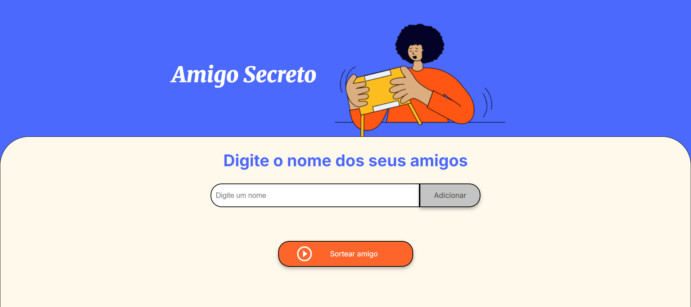
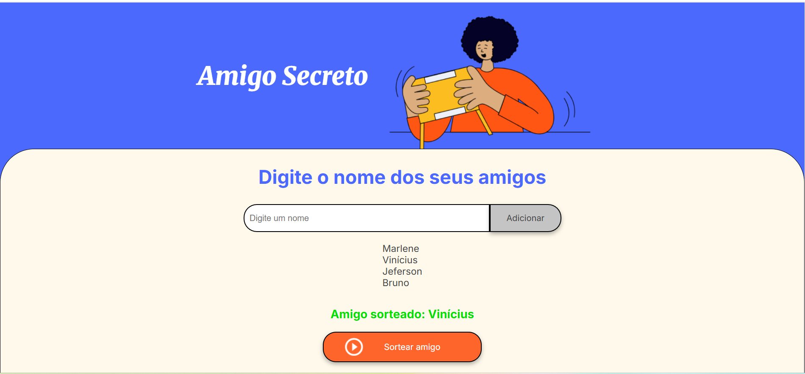

<h1 align="center"> Amigo Secreto</h1>

## DESCRIÇÃO DO PROJETO 

Desafio Challenge Amigo Screto, proposto pela ONE + Alura LATAM, tendo como objetivo:

Desenvolver uma aplicação que permita aos usuários inserir nomes de amigos em uma lista para, em seguida, realizar um sorteio aleatório e determinar quem é o "amigo secreto".

## COMO FUNCIONA

- O usuário deverá adicionar nomes por meio de um campo de texto e de um botão "Adicionar".

- Os nomes inseridos serão exibidos em uma lista visível na página, e ao finalizar, um botão "Sortear Amigo" selecionará um dos nomes de forma aleatória, exibindo o resultado na tela.

# :hammer: FUNCIONALIDADES DO PROJETO

- `Funcionalidade 1 Adicionar nomes`: Os usuários informam o nome de um amigo(a) no campo de texto "Digite um nome" e o adiciona a uma lista visível logo abaixo ao clicar no botão "Adicionar".

- `Funcionalidade 2 Validar entrada`: Se o campo de texto estiver vazio, o programa exibirá um alerta solicitando um nome válido.

- `Funcionalidade 3 Visualizar a lista`: Os nomes inseridos aparecerão em uma lista abaixo do campo de entrada.

- `Funcionalidade 4 Sorteio aleatório`: Ao clicar no botão "Sortear Amigo", um nome da lista será selecionado aleatoriamente e exibido na página.

